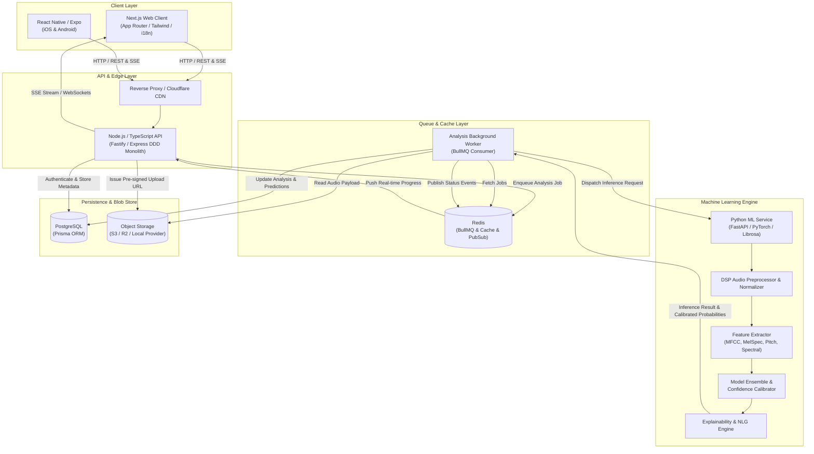
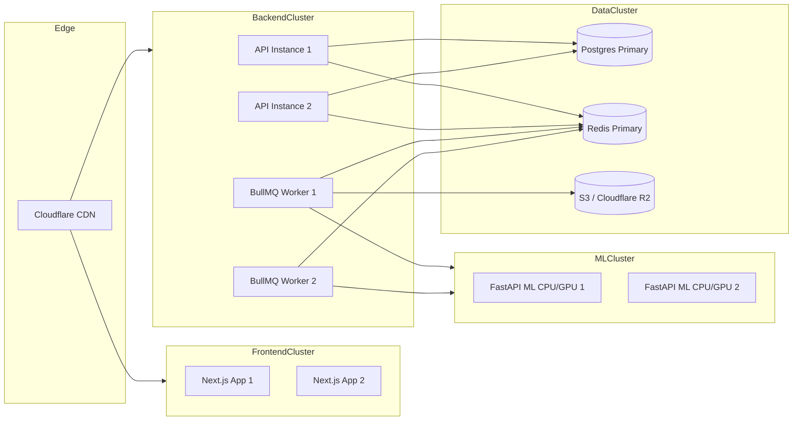

# System Architecture Document
## Project Name: MewSense (AI-Powered Cat Vocalization Analysis Application)
**Document Version:** 1.0.0  
**Status:** Approved Architecture

---

## 1. High-Level Architectural Overview

MewSense is structured as a decoupled, modular monorepo consisting of:
1. **Web Client (`apps/web`):** Next.js App Router, React 18+, TypeScript, Tailwind CSS, TanStack Query, Web Audio API with real-time waveform recording and spectrogram preview.
2. **Mobile Client (`apps/mobile`):** React Native / Expo application with microphone permissions, offline queue, and shared domain contracts.
3. **Core Backend API (`apps/api`):** Node.js / TypeScript service implementing Domain-Driven Design (DDD) layered architecture (Presentation -> Application -> Domain -> Infrastructure).
4. **Asynchronous Worker (`workers/analysis-worker`):** BullMQ worker processing audio validation, normalization, and communicating with the ML engine.
5. **Machine Learning Service (`apps/ml-service`):** Python FastAPI microservice dedicated to acoustic digital signal processing (DSP), feature extraction (Mel spectrograms, MFCCs, $F_0$ pitch tracking, spectral energy), ensemble inference, confidence calibration, and explainability reasoning.
6. **Data Stores:**
   * **PostgreSQL:** Normalized relational persistence via Prisma ORM.
   * **Redis:** BullMQ job broker, distributed rate-limiting token bucket, and real-time pub/sub for SSE / WebSocket event dispatch.
   * **Object Storage:** Pluggable `ObjectStorage` abstraction supporting local file storage (for zero-dependency offline/dev runs) and S3 / Cloudflare R2 / GCS for production.



---

## 2. Domain-Driven Design (DDD) & Layered Architecture

The Core Backend (`apps/api`) adheres strictly to clean architecture boundaries:

```text
apps/api/src/
├── presentation/         # HTTP controllers, route definitions, middlewares, DTOs
│   ├── controllers/      # Auth, Cats, Audio, Analysis, Feedback, Models, Admin
│   ├── middlewares/      # AuthGuard, RoleGuard, RateLimiter, AuditLogger, ErrorHandler
│   └── routes/           # Fastify/Express typed route registries
│
├── application/           # Application use cases, orchestrators, command/query handlers
│   ├── use-cases/        # RegisterUser, CreateCat, EnqueueAnalysis, ProcessPredictionResult
│   ├── dtos/             # Input/Output DTO schemas with Zod validation
│   └── services/         # TokenService, StorageService, EventPublisher
│
├── domain/               # Enterprise business rules & pure domain models (Zero framework dependencies)
│   ├── entities/         # User, Cat, AudioRecording, Analysis, Prediction, Feedback
│   ├── value-objects/    # ConfidenceScore, AudioFormat, VocalizationType, ContextIntent
│   ├── repositories/     # Interfaces for ICatRepository, IAnalysisRepository, etc.
│   └── events/           # Domain events: AnalysisStarted, AnalysisCompleted, DistressDetected
│
└── infrastructure/       # Concrete adapters for external systems
    ├── database/         # Prisma client, concrete repositories implementing domain interfaces
    ├── storage/          # S3StorageProvider, LocalDiskStorageProvider
    ├── queue/            # BullMQQueueProvider, InMemoryQueueFallback
    ├── ml-client/        # HTTP client calling the Python ML microservice
    └── logger/           # Structured JSON logger (Pino / Winston)
```

---

## 3. Audio Ingestion & Processing Pipeline

```mermaid
sequenceDiagram
    autonumber
    actor User as User / Client
    participant API as API Server
    participant Storage as Object Storage
    participant Queue as Redis / BullMQ
    participant Worker as Audio Analysis Worker
    participant ML as Python ML Service
    participant DB as PostgreSQL (Prisma)

    User->>API: POST /api/v1/audio/presign-upload (mimeType, size, catId, context)
    API->>API: Validate file metadata (MIME, size <= 15MB) & permissions
    API->>Storage: Generate Pre-Signed Upload URL (or local upload token)
    API->>DB: Create AudioRecording (status: PENDING_UPLOAD)
    API-->>User: Return uploadUrl, recordingId, signedHeaders

    User->>Storage: Direct PUT/POST binary audio (with content-type)
    User->>API: POST /api/v1/analysis (recordingId, contextualData)
    API->>Storage: Verify file presence & inspect magic bytes
    API->>DB: Create Analysis (status: QUEUED)
    API->>Queue: Push analysis job { analysisId, recordingId, s3Key, context }
    API-->>User: 202 Accepted { analysisId, streamUrl }

    Queue->>Worker: Consume analysis job
    Worker->>DB: Update Analysis status: PROCESSING (audio_prep)
    Worker->>API: Publish SSE event: "Processing audio & validating format"
    Worker->>Storage: Stream audio stream
    Worker->>Worker: FFmpeg validation (sample rate, mono conversion, duration check)
    Worker->>DB: Update AudioMetadata (channels, duration, sampleRate, snr)

    Worker->>DB: Update Analysis status: EXTRACTING_FEATURES
    Worker->>API: Publish SSE event: "Extracting acoustic features"
    
    Worker->>ML: POST /v1/infer (audio binary / normalized stream, context)
    ML->>ML: Compute Mel Spectrogram, MFCC, Pitch (F0), Spectral Centroid
    ML->>ML: Forward pass through Ensemble / CNN Classifier
    ML->>ML: Platt / Softmax Temperature Calibration
    ML->>ML: Run Explainability NLG Engine
    ML-->>Worker: Return { soundType, probableContext, confidence, features, rationale }

    Worker->>DB: Save Prediction & ModelVersion link; status: COMPLETED
    Worker->>API: Publish SSE event: "Completed"
    User->>API: Read final result via SSE or GET /api/v1/analysis/:id
```

---

## 4. Machine Learning Service Architecture

The Python ML Microservice (`apps/ml-service`) is engineered to be lightweight, reproducible, and horizontally scalable:

### 4.1 Feature Extraction Pipeline (`ml/features.py`)
* **Audio Input:** 16 kHz, single-channel (mono), 32-bit floating point PCM.
* **Spectral Analysis:**
  * 128 Mel-frequency bins (50 Hz to 8000 Hz).
  * 20 MFCCs with 1st and 2nd temporal derivatives ($\Delta, \Delta\Delta$).
  * Zero-Crossing Rate (ZCR) and Root-Mean-Square (RMS) Energy.
  * Spectral Centroid, Spectral Bandwidth, Spectral Rolloff (85th percentile).
  * Fundamental Frequency ($F_0$) estimation using PYIN algorithm with voiced probability mask.

### 4.2 Two-Stage Classification & Bayesian Context Integration
1. **Stage 1: Acoustic Vocalization Classifier:**
   * Classifies physical sound into 8 classes: `MEOW`, `PURR`, `HISS`, `GROWL`, `CHIRP_TRILL`, `CATERWAUL`, `YOWL`, `OTHER_UNKNOWN`.
   * Baseline model: Calibrated Gradient Boosted Ensemble / Random Forest + Lightweight 1D/2D CNN on log-Mel spectrograms.
2. **Stage 2: Contextual Intent Estimator:**
   * Computes posterior probability distribution over 10 behavioral states:
     $$P(\text{Behavior} \mid \text{Acoustic Class}, \text{Context})$$
   * Incorporates cat age, sex, neutered status, time of day, presence of food, presence of other cats/dogs/strangers, and current activity.
3. **Stage 3: Confidence Calibration & Out-of-Distribution (OOD) Guardrail:**
   * If maximum posterior probability $P < \tau_{\text{threshold}}$ (default: 0.45) or sound-to-noise ratio $\text{SNR} < 6\text{ dB}$, the output is calibrated down to `UNKNOWN_INSUFFICIENT_CONFIDENCE`.

### 4.3 Explainability Generator (`ml/explain.py`)
Generates transparent, structured reasoning such as:
> *"The audio demonstrates a rising pitch contour (fundamental frequency $F_0$ shifting from 480 Hz to 720 Hz) and short duration (0.78s) with moderate acoustic energy, characteristic of a solicitation meow. Combined with the user-reported context that food has not been served recently, the model estimates an elevated probability of food-seeking behavior."*

---

## 5. Storage Abstraction

```typescript
export interface StorageUploadOptions {
  key: string;
  contentType: string;
  maxSizeBytes?: number;
}

export interface StorageSignedUrlResult {
  uploadUrl: string;
  fileKey: string;
  publicUrl?: string;
  expiresInSeconds: number;
}

export interface IObjectStorage {
  generatePresignedUploadUrl(options: StorageUploadOptions): Promise<StorageSignedUrlResult>;
  downloadStream(key: string): Promise<NodeJS.ReadableStream>;
  uploadBuffer(key: string, buffer: Buffer, contentType: string): Promise<string>;
  deleteObject(key: string): Promise<void>;
  getSignedDownloadUrl(key: string, expiresInSeconds?: number): Promise<string>;
  verifyObjectExists(key: string): Promise<boolean>;
}
```

* **Local Storage Provider:** Writes securely to an isolated directory with hash-based paths, preventing path traversal. Allows running the entire system locally without AWS/Cloudflare credentials.
* **S3 / R2 Provider:** Uses `@aws-sdk/client-s3` and `@aws-sdk/s3-request-presigner` for cloud environments.

---

## 6. Real-Time Status & Event Flow

To support smooth UX during the 1–3 second inference phase, the backend exposes:
* **Server-Sent Events (SSE):** `GET /api/v1/analysis/:id/stream`
* Event Types:
  * `step:uploading`
  * `step:processing_audio`
  * `step:extracting_features`
  * `step:running_ai_model`
  * `step:generating_interpretation`
  * `result:completed` (payload includes complete analysis)
  * `result:failed` (payload includes friendly error code)
* Fallback: If SSE is interrupted or unsupported by the client network, the client smoothly falls back to short polling `GET /api/v1/analysis/:id`.

---

## 7. Security Architecture & Threat Mitigation

| Threat Vector | Mitigation Strategy |
| :--- | :--- |
| **Malicious File Upload** | Enforce MIME inspection, file header/magic bytes check, FFprobe audio integrity probe, and absolute file size hard limits (15 MB). Prevent executable execution in storage directories. |
| **Path Traversal / SSRF** | Storage keys are generated strictly server-side using cryptographically secure UUIDv4. User input never influences bucket paths. |
| **Credential & Secret Leakage** | All cloud keys, JWT secrets, and DB URLs are isolated in `.env` variables and validated at startup using Zod schema. Client bundles bundle zero backend secrets. |
| **Brute Force & DoS** | Redis-backed token bucket rate limiter: 10 uploads/min per user, 60 reads/min. Global rate limiter 300 req/min per IP. |
| **Data Privacy & GDPR** | Private-by-default recordings. Separate database column `allowTrainingConsent` (default: `false`). Deletion cascade permanently deletes audio files from object storage and database. |

---

## 8. Scalability & Deployment Topography


