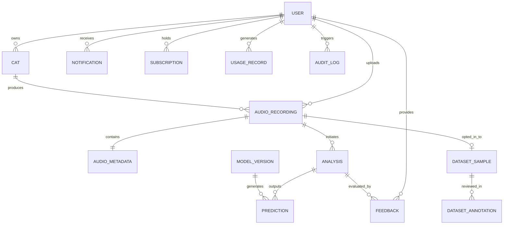

# Database Schema & Relational Model Document
## Project Name: MewSense (AI-Powered Cat Vocalization Analysis Application)
**Document Version:** 1.0.0  
**Database Engine:** PostgreSQL 15+  
**ORM:** Prisma ORM  

---

## 1. Entity-Relationship Overview

---

## 2. Table Specifications & Data Dictionaries

### 2.1 `users`
Represents application accounts with secure credentials, roles, and privacy flags.

| Column | Type | Constraints | Description |
| :--- | :--- | :--- | :--- |
| `id` | `UUID` | PRIMARY KEY, default `gen_random_uuid()` | Unique user identifier |
| `email` | `VARCHAR(255)` | UNIQUE, NOT NULL | Account email address |
| `passwordHash` | `VARCHAR(255)` | NOT NULL | Argon2id/Bcrypt hashed password |
| `fullName` | `VARCHAR(128)` | NOT NULL | Display name |
| `role` | `ENUM` | NOT NULL, default `USER` | `USER`, `ANNOTATOR`, `RESEARCHER`, `ADMIN`, `SUPER_ADMIN` |
| `isEmailVerified`| `BOOLEAN` | NOT NULL, default `false` | Email verification flag |
| `avatarUrl` | `VARCHAR(512)` | NULLABLE | Profile picture URL |
| `allowTrainingConsent` | `BOOLEAN` | NOT NULL, default `false` | Explicit opt-in for research model training |
| `languagePreference` | `VARCHAR(10)` | NOT NULL, default `'en'` | Preferred UI language (`'en'`, `'bn'`) |
| `createdAt` | `TIMESTAMPTZ` | NOT NULL, default `NOW()` | Record creation timestamp |
| `updatedAt` | `TIMESTAMPTZ` | NOT NULL, auto-update | Record modification timestamp |
| `deletedAt` | `TIMESTAMPTZ` | NULLABLE | Soft deletion timestamp |

**Indexes:**
* `CREATE UNIQUE INDEX idx_users_email ON users(email) WHERE deleted_at IS NULL;`
* `CREATE INDEX idx_users_role ON users(role);`

---

### 2.2 `cats`
Stores individual feline profiles associated with users.

| Column | Type | Constraints | Description |
| :--- | :--- | :--- | :--- |
| `id` | `UUID` | PRIMARY KEY | Unique cat profile identifier |
| `userId` | `UUID` | FK -> `users(id)` ON DELETE CASCADE | Owner user ID |
| `name` | `VARCHAR(64)` | NOT NULL | Cat's name |
| `breed` | `VARCHAR(64)` | NULLABLE | Breed (e.g., Domestic Shorthair, Persian, Bengal) |
| `birthDate` | `DATE` | NULLABLE | Approximate birth date |
| `sex` | `ENUM` | NOT NULL | `MALE`, `FEMALE`, `UNKNOWN` |
| `isNeutered` | `BOOLEAN` | NOT NULL, default `true` | Spayed / Neutered status |
| `avatarUrl` | `VARCHAR(512)` | NULLABLE | Cat profile image |
| `medicalNotes` | `TEXT` | NULLABLE | Non-diagnostic notes (e.g. chronic conditions) |
| `createdAt` | `TIMESTAMPTZ` | NOT NULL | Creation timestamp |
| `updatedAt` | `TIMESTAMPTZ` | NOT NULL | Modification timestamp |
| `deletedAt` | `TIMESTAMPTZ` | NULLABLE | Soft deletion |

**Indexes:**
* `CREATE INDEX idx_cats_user_id ON cats(user_id) WHERE deleted_at IS NULL;`

---

### 2.3 `audio_recordings`
Stores audio metadata, storage locator references, and recorded contextual state.

| Column | Type | Constraints | Description |
| :--- | :--- | :--- | :--- |
| `id` | `UUID` | PRIMARY KEY | Recording identifier |
| `userId` | `UUID` | FK -> `users(id)` ON DELETE CASCADE | Owner user ID |
| `catId` | `UUID` | NULLABLE, FK -> `cats(id)` ON DELETE SET NULL | Associated cat (if selected) |
| `storageKey` | `VARCHAR(512)` | NOT NULL, UNIQUE | Secure storage path (UUID key in bucket) |
| `storageProvider` | `VARCHAR(32)` | NOT NULL, default `'local'` | `'s3'`, `'r2'`, `'local'` |
| `originalFilename` | `VARCHAR(255)` | NOT NULL | Uploaded filename |
| `mimeType` | `VARCHAR(64)` | NOT NULL | Verified MIME type |
| `fileSizeBytes` | `BIGINT` | NOT NULL | File size in bytes |
| `sha256Hash` | `VARCHAR(64)` | NOT NULL | Cryptographic checksum for idempotency |
| `source` | `ENUM` | NOT NULL | `MICROPHONE_WEB`, `MICROPHONE_MOBILE`, `FILE_UPLOAD` |
| `contextEnvironment` | `VARCHAR(64)` | NULLABLE | `'indoor'`, `'outdoor'`, `'vet_clinic'`, `'cage'` |
| `contextActivity` | `VARCHAR(64)` | NULLABLE | `'resting'`, `'playful'`, `'feeding'`, `'exploring'` |
| `contextFoodPresent` | `BOOLEAN` | NULLABLE | Whether food was visible/served |
| `contextOtherAnimals`| `BOOLEAN` | NULLABLE | Other cats/dogs/strangers nearby |
| `contextUserNotes` | `TEXT` | NULLABLE | Freeform guardian observation |
| `isConsentedForResearch` | `BOOLEAN` | NOT NULL, default `false` | Anonymized ML training consent |
| `createdAt` | `TIMESTAMPTZ` | NOT NULL | Creation timestamp |
| `updatedAt` | `TIMESTAMPTZ` | NOT NULL | Modification timestamp |
| `deletedAt` | `TIMESTAMPTZ` | NULLABLE | Soft deletion |

**Indexes:**
* `CREATE INDEX idx_audio_recordings_user ON audio_recordings(user_id);`
* `CREATE INDEX idx_audio_recordings_cat ON audio_recordings(cat_id);`
* `CREATE INDEX idx_audio_recordings_hash ON audio_recordings(sha256_hash);`

---

### 2.4 `audio_metadata`
Detailed digital signal processing (DSP) acoustic measurements.

| Column | Type | Constraints | Description |
| :--- | :--- | :--- | :--- |
| `id` | `UUID` | PRIMARY KEY | Metadata identifier |
| `recordingId` | `UUID` | UNIQUE, FK -> `audio_recordings(id)` ON DELETE CASCADE | Associated recording |
| `durationSeconds` | `FLOAT` | NOT NULL | Duration in seconds |
| `sampleRate` | `INTEGER` | NOT NULL | Standardized sample rate (e.g., 16000 Hz) |
| `channels` | `SMALLINT` | NOT NULL | Channel count (1 = mono, 2 = stereo) |
| `bitDepth` | `SMALLINT` | NULLABLE | Audio bit depth |
| `rmsEnergy` | `FLOAT` | NOT NULL | Root-mean-square acoustic energy |
| `pitchF0Min` | `FLOAT` | NULLABLE | Minimum fundamental frequency ($Hz$) |
| `pitchF0Max` | `FLOAT` | NULLABLE | Maximum fundamental frequency ($Hz$) |
| `pitchF0Mean` | `FLOAT` | NULLABLE | Mean fundamental frequency ($Hz$) |
| `spectralCentroidMean` | `FLOAT`| NOT NULL | Average spectral centroid ($Hz$) |
| `zeroCrossingRateMean` | `FLOAT`| NOT NULL | Average ZCR |
| `snrDb` | `FLOAT` | NULLABLE | Estimated signal-to-noise ratio in decibels |
| `spectrogramThumbnailUrl` | `VARCHAR(512)` | NULLABLE | Mel-spectrogram image preview locator |
| `createdAt` | `TIMESTAMPTZ` | NOT NULL | Creation timestamp |

---

### 2.5 `analyses`
Tracks individual asynchronous inference jobs and pipeline execution stages.

| Column | Type | Constraints | Description |
| :--- | :--- | :--- | :--- |
| `id` | `UUID` | PRIMARY KEY | Analysis task identifier |
| `recordingId` | `UUID` | FK -> `audio_recordings(id)` ON DELETE CASCADE | Audio sample |
| `status` | `ENUM` | NOT NULL, default `QUEUED` | `QUEUED`, `PROCESSING`, `COMPLETED`, `FAILED`, `CANCELLED` |
| `stage` | `VARCHAR(64)` | NOT NULL, default `'queued'` | `'uploading'`, `'audio_prep'`, `'feature_ext'`, `'ai_model'`, `'interpretation'`, `'done'` |
| `errorMessage` | `TEXT` | NULLABLE | Safe failure description |
| `processingStartedAt` | `TIMESTAMPTZ` | NULLABLE | Worker intake timestamp |
| `completedAt` | `TIMESTAMPTZ` | NULLABLE | Completion timestamp |
| `latencyMs` | `INTEGER` | NULLABLE | Total processing duration in milliseconds |
| `createdAt` | `TIMESTAMPTZ` | NOT NULL | Creation timestamp |
| `updatedAt` | `TIMESTAMPTZ` | NOT NULL | Modification timestamp |

**Indexes:**
* `CREATE INDEX idx_analyses_recording ON analyses(recording_id);`
* `CREATE INDEX idx_analyses_status ON analyses(status);`

---

### 2.6 `model_versions`
Maintains immutable records of production and candidate ML models.

| Column | Type | Constraints | Description |
| :--- | :--- | :--- | :--- |
| `id` | `UUID` | PRIMARY KEY | Model identifier |
| `name` | `VARCHAR(64)` | NOT NULL | e.g. `'mewsense-acoustic-cnn'` |
| `version` | `VARCHAR(32)` | NOT NULL, UNIQUE | e.g. `'v1.0.0'`, `'v1.1.0'` |
| `description` | `TEXT` | NOT NULL | Architecture and training dataset details |
| `metrics` | `JSONB` | NOT NULL | Macro F1, Per-class Precision/Recall, Kappa |
| `status` | `ENUM` | NOT NULL, default `ACTIVE` | `ACTIVE`, `CANDIDATE`, `DEPRECATED`, `ROLLED_BACK` |
| `deployedAt` | `TIMESTAMPTZ` | NOT NULL, default `NOW()` | Deployment timestamp |
| `createdAt` | `TIMESTAMPTZ` | NOT NULL | Record creation timestamp |

---

### 2.7 `predictions`
Captures model outputs, calibrated probability distributions, and explainability narratives.

| Column | Type | Constraints | Description |
| :--- | :--- | :--- | :--- |
| `id` | `UUID` | PRIMARY KEY | Prediction identifier |
| `analysisId` | `UUID` | FK -> `analyses(id)` ON DELETE CASCADE | Analysis job |
| `modelVersionId` | `UUID` | FK -> `model_versions(id)` | Model used for inference |
| `primarySoundType` | `VARCHAR(32)` | NOT NULL | `MEOW`, `PURR`, `HISS`, `GROWL`, `CHIRP_TRILL`, `CATERWAUL`, `YOWL`, `OTHER_UNKNOWN` |
| `probableContext` | `VARCHAR(32)` | NOT NULL | `HUNGRY_FOOD_SEEKING`, `ATTENTION_SEEKING`, `GREETING_SOCIAL`, `PLAYFUL_EXCITED`, `FEAR_ANXIETY`, `DEFENSIVE_THREATENED`, `DISCOMFORT_POSSIBLE_PAIN`, `MATING_CALL`, `TERRITORIAL_BEHAVIOR`, `UNKNOWN_INSUFFICIENT_CONFIDENCE` |
| `confidence` | `FLOAT` | NOT NULL | Calibrated confidence score (0.0 to 1.0) |
| `soundProbabilities` | `JSONB` | NOT NULL | Distribution across all vocalization classes |
| `contextProbabilities` | `JSONB` | NOT NULL | Distribution across all behavioral contexts |
| `explanationText` | `TEXT` | NOT NULL | Transparent natural language rationale |
| `scientificDisclaimer`| `TEXT` | NOT NULL | Non-diagnostic legal & veterinary safety notice |
| `isDistressPattern` | `BOOLEAN` | NOT NULL, default `false` | Flag indicating potential discomfort/fear marker |
| `createdAt` | `TIMESTAMPTZ` | NOT NULL | Creation timestamp |

**Indexes:**
* `CREATE INDEX idx_predictions_analysis ON predictions(analysis_id);`
* `CREATE INDEX idx_predictions_model ON predictions(model_version_id);`

---

### 2.8 `feedbacks`
Captures user rating and corrections for continuous quality monitoring.

| Column | Type | Constraints | Description |
| :--- | :--- | :--- | :--- |
| `id` | `UUID` | PRIMARY KEY | Feedback identifier |
| `userId` | `UUID` | FK -> `users(id)` ON DELETE CASCADE | User submitting feedback |
| `analysisId` | `UUID` | FK -> `analyses(id)` ON DELETE CASCADE | Target analysis |
| `isAccurate` | `BOOLEAN` | NOT NULL | Whether user agreed with prediction |
| `userPerceivedSound` | `VARCHAR(32)` | NULLABLE | User's alternative acoustic assessment |
| `userPerceivedContext` | `VARCHAR(32)` | NULLABLE | User's alternative contextual assessment |
| `notes` | `TEXT` | NULLABLE | Freeform comments |
| `createdAt` | `TIMESTAMPTZ` | NOT NULL | Creation timestamp |

---

### 2.9 `dataset_samples` & `dataset_annotations`
Maintains research-ready, human-annotated datasets with group-aware cat separation.

| Table | Columns | Details |
| :--- | :--- | :--- |
| `dataset_samples` | `id`, `audioRecordingId`, `datasetSplit` (`TRAIN`, `VAL`, `TEST`), `groupCatId`, `status` (`UNANNOTATED`, `IN_REVIEW`, `VERIFIED`), `createdAt` | Grouped by cat to prevent acoustic data leakage |
| `dataset_annotations` | `id`, `datasetSampleId`, `annotatorUserId`, `labeledSoundType`, `labeledContext`, `confidenceRating`, `notes`, `createdAt` | Enables multi-annotator agreement (Fleiss' Kappa) |

---

### 2.10 Supporting Tables: `subscriptions`, `usage_records`, `notifications`, `audit_logs`
* `subscriptions`: Plan tier (`FREE`, `PRO`, `SHELTER`), status, Stripe customer ID, renewal timestamps.
* `usage_records`: Daily count of recordings and minutes processed per user.
* `notifications`: In-app system alerts, analysis completion notices, and security alerts.
* `audit_logs`: Immutable tracking of security actions (logins, role changes, data deletions, model deployments).
