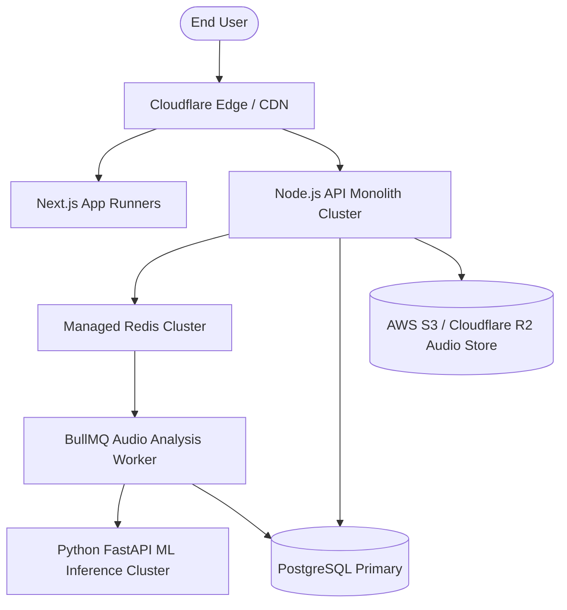

# Production Deployment Guide
## Project: MewSense

---

## 1. Quick Local Development Setup

### Prerequisites
* Node.js v20+
* pnpm v9+ or `corepack enable`
* Python 3.9+
* PostgreSQL 15+ (local or Docker)

### Step 1: Install Dependencies
```bash
# In repository root
npx pnpm install
npx pnpm approve-builds --all
```

### Step 2: Database Setup & Seed
```bash
# Push schema to local PostgreSQL
npx pnpm db:push

# Seed default models, demo cats, and users
npx pnpm db:seed
```

### Step 3: Run the Services
```bash
# Start backend API (Port 4000)
npx pnpm dev:api

# Start Next.js web application (Port 3000)
npx pnpm dev:web

# Start Python ML microservice (Port 8000)
npx pnpm dev:ml
```

Open `http://localhost:3000` in your browser.

---

## 2. Docker & Containerized Deployment

To launch the complete production cluster with PostgreSQL, Redis, ML Service, Node.js API, and Next.js Web:

```bash
docker compose up --build -d
```

### Healthcheck Endpoints
* **API Service:** `http://localhost:4000/api/v1/health`
* **ML Microservice:** `http://localhost:8000/v1/health`
* **Web Client:** `http://localhost:3000`

---

## 3. Cloud Production Topography



### Cloud Environment Variables Checklist
* `DATABASE_URL`: Managed PostgreSQL connection string with SSL mode (`sslmode=require`).
* `REDIS_URL`: Managed Redis / Upstash URL with TLS (`rediss://`).
* `STORAGE_PROVIDER`: `'s3'` or `'r2'`.
* `AWS_ACCESS_KEY_ID` & `AWS_SECRET_ACCESS_KEY`: Object storage IAM keys with minimal bucket read/write permissions.
* `AWS_S3_BUCKET`: Private audio bucket name.
* `JWT_SECRET`: 64-character cryptographically random secret string.
* `ML_SERVICE_SECRET`: Internal shared secret for microservice mutual authentication.
