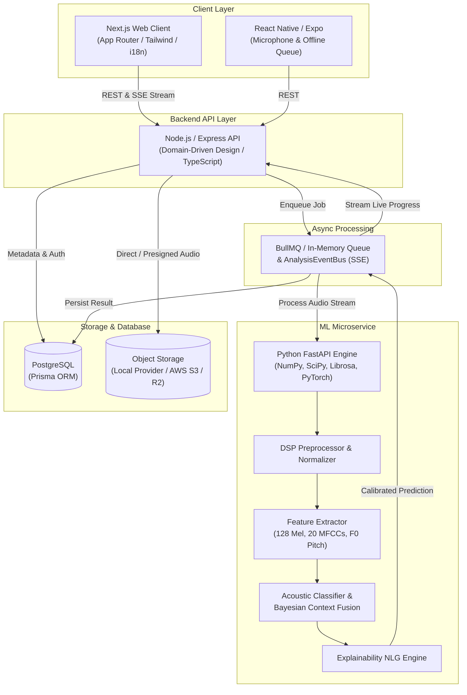

# 🐱 MewSense — Understand the Sound, Not Just the Meow.

> **Tagline:** *Understand the Sound, Not Just the Meow.*  
> Production-grade, privacy-centric AI cat vocalization analysis and calibrated bioacoustic interpretation.

[](https://www.typescriptlang.org/)
[](https://nextjs.org/)
[](https://fastapi.tiangolo.com/)
[](https://www.prisma.io/)
[](https://www.postgresql.org/)
[](https://www.docker.com/)

> **Important Scientific & Veterinary Boundary:**  
> MewSense does **not** claim to literally "translate cat language" or read feline thoughts. Feline acoustic communication is multimodal, adaptive, and context-dependent. MewSense performs **probabilistic bioacoustic classification** accompanied by calibrated confidence scores, transparent explainability, and veterinary safety disclaimers.

---

## 🌟 Key Capabilities

1. **🎙 In-Browser & Mobile Audio Recording:** High-DPI real-time waveform visualizer via HTML5 Web Audio API `AudioContext` and AnalyserNode.
2. **📁 Multi-Format Audio Upload:** Supports `.wav`, `.mp3`, `.m4a`, `.ogg`, and `.webm` up to 15MB with automatic sample rate normalization to 16 kHz.
3. **⚡ Asynchronous Inference Pipeline:** Redis + BullMQ job queue with resilient in-memory fallback and live Server-Sent Events (SSE) progress streaming.
4. **🧠 Calibrated ML Service:** Python FastAPI microservice extracting 128-band Mel Spectrograms, 20 MFCCs, fundamental frequency ($F_0$) pitch tracking, and Bayesian contextual fusion.
5. **🛡 Scientific Honesty & OOD Guardrails:** Automatically outputs `Unknown / Insufficient confidence` when confidence falls below 45% or background noise is too high.
6. **⚠️ Veterinary Distress Detection:** Prominently alerts guardians if acoustic patterns resemble pain, yowling, or extreme defensive fear with an explicit medical disclaimer.
7. **🐱 Cat Profile Management:** Create and manage individual companion profiles (breed, age, sex, spayed/neutered status).
8. **📊 Longitudinal History & Playback:** Filter and listen back to historical vocalizations over time.
9. **🌐 Multilingual Support:** Native bilingual user experience in **English** and **Bengali (বাংলা)**.
10. **🔒 Private by Default & Consented Datasets:** User recordings are never used for model training without explicit, separate opt-in consent.

---

## 🏛 System Architecture



---

## 📁 Monorepo Structure

```text
MewSense/
├── apps/
│   ├── web/               # Next.js App Router frontend with i18n and Web Audio visualizer
│   ├── api/               # Express / Node.js backend following Domain-Driven Design (DDD)
│   ├── ml-service/        # Python FastAPI service with bioacoustic DSP and ensemble inference
│   └── mobile/            # React Native Expo mobile app with offline recording queue
│
├── packages/
│   ├── shared-types/      # Strongly typed domain entities, enums, and API contracts
│   └── validation/        # Zod validation schemas for all inputs and feline constraints
│
├── ml/
│   ├── datasets/          # Group-based dataset pipeline preventing cat-level data leakage
│   └── evaluation/        # Macro F1, confusion matrix, and distress sensitivity evaluation
│
├── infrastructure/
│   ├── docker/            # Multi-stage production Dockerfiles (api, web, ml)
│   └── deployment/        # Cloud architecture topology guides
│
├── docs/ & Root Documentation:
│   ├── PRD.md             # Product Requirements Document & Scientific Boundary
│   ├── ARCHITECTURE.md    # High-level architecture, DDD layers & sequence diagrams
│   ├── DATABASE.md        # Relational schema, Prisma models, indexes & ER diagram
│   ├── API.md             # Standard REST API specifications, DTOs & SSE envelopes
│   ├── ML_PIPELINE.md     # Bioacoustic signal processing, Bayesian fusion & taxonomy
│   ├── SECURITY.md        # Threat model, rate limiting, and GDPR privacy compliance
│   ├── DEPLOYMENT.md      # Local, Docker Compose, and Cloud deployment instructions
│   └── CONTRIBUTING.md    # Development and code quality standards
│
├── docker-compose.yml     # Complete multi-container production cluster
├── package.json           # Monorepo scripts and workspace configuration
└── README.md              # Project overview and quick start guide
```

---

## 🚀 Quick Start (Local Run)

### 1. Install Dependencies
```bash
npx pnpm install
npx pnpm approve-builds --all
```

### 2. Database Synchronization & Seed
```bash
npx pnpm db:push
npx pnpm db:seed
```

### 3. Launch Services
```bash
# Terminal 1: Backend API (Port 4000)
npx pnpm dev:api

# Terminal 2: Web Client (Port 3000)
npx pnpm dev:web

# Terminal 3: ML Microservice (Port 8000)
apps/ml-service/venv/bin/uvicorn main:app --app-dir apps/ml-service --reload --port 8000
```

Visit **[http://localhost:3000](http://localhost:3000)** in your browser.  
Seed login credentials for zero-friction access:
* **Email:** `guardian@mewsense.app`
* **Password:** `MewSense2026!`

---

## 🧪 Testing Suite

MewSense includes complete automated testing layers:

```bash
# Run Backend API, Repository & End-to-End User Journey Tests (Vitest)
pnpm --filter @mewsense/api run test

# Run Python ML Feature Extraction & Acoustic Ensemble Tests (Pytest)
PYTHONPATH=apps/ml-service apps/ml-service/venv/bin/python3 -m pytest apps/ml-service/test_ml.py -v

# Run Evaluation Benchmark Metrics
apps/ml-service/venv/bin/python3 ml/evaluation/eval.py

# Typecheck Entire Workspace
pnpm typecheck
```

---

## 🐳 Docker Production Cluster

Run the entire cluster with PostgreSQL, Redis, ML Microservice, Node.js API, and Next.js Web:

```bash
docker compose up --build -d
```

---

## 📄 License & Welfare Statement

MewSense is dedicated to the ethical study of feline welfare and bioacoustics. Never use sound analysis as a substitute for professional veterinary care.
